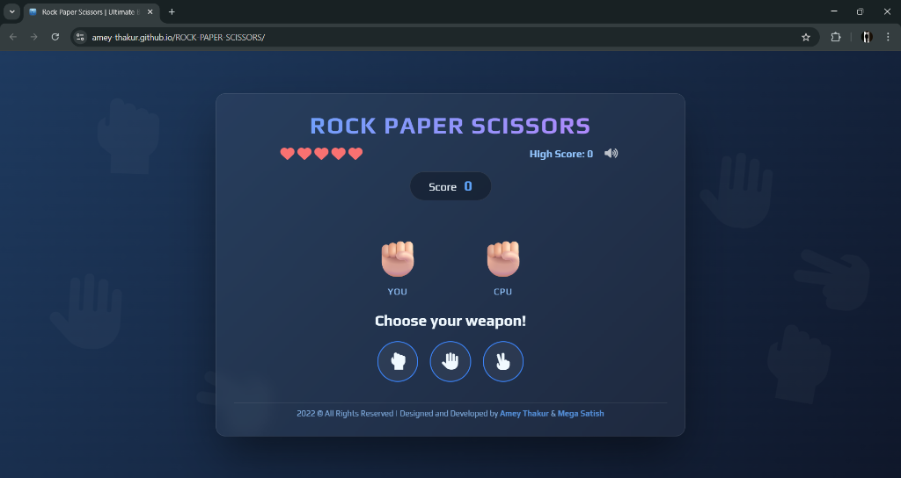
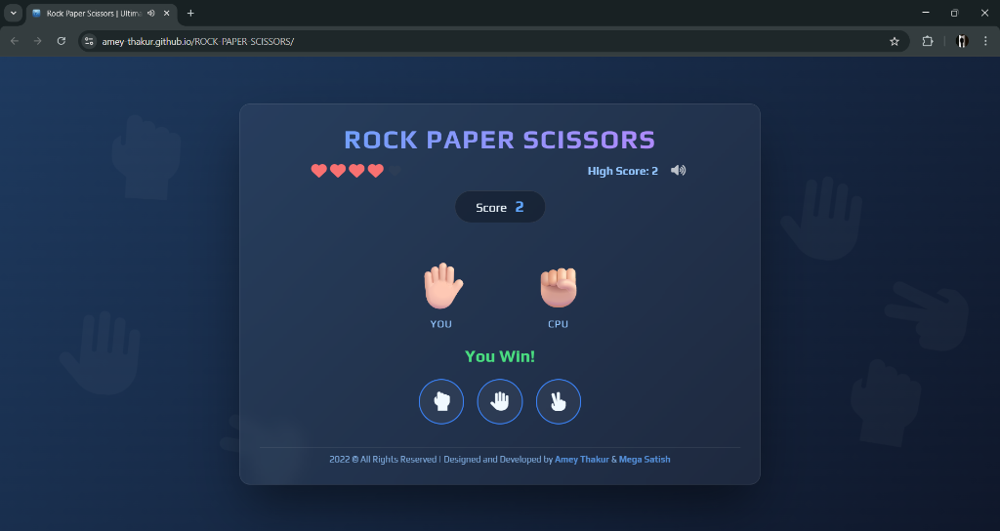
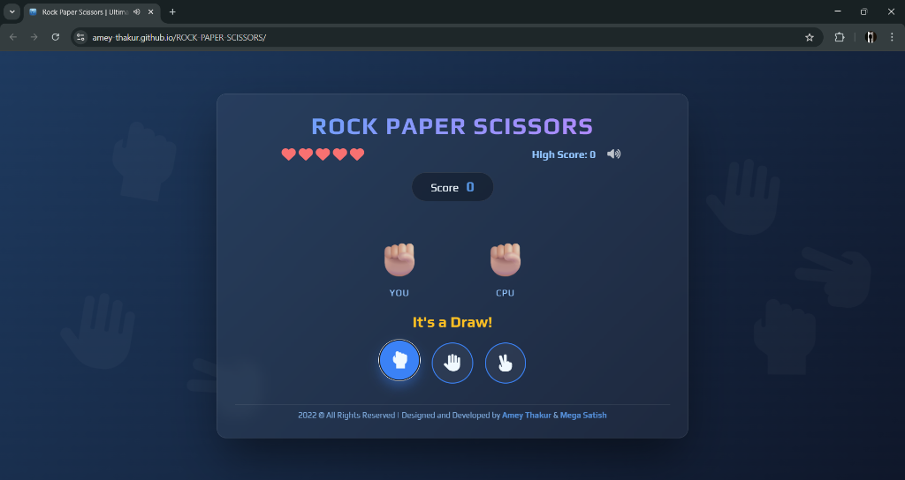
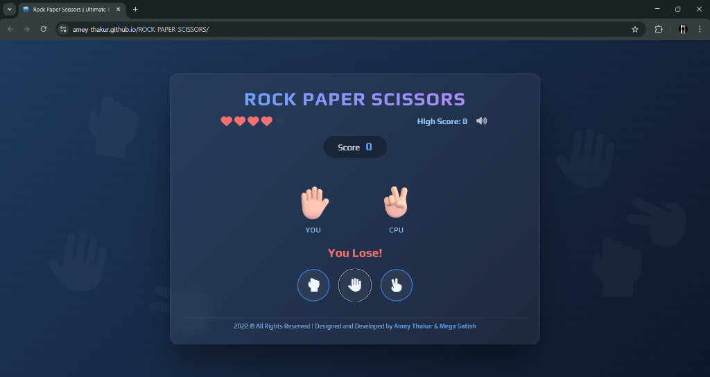
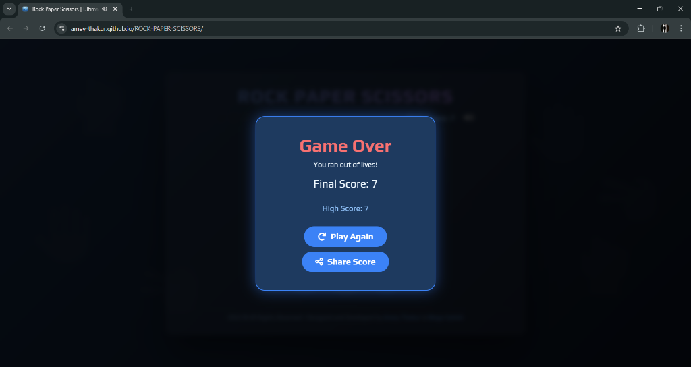
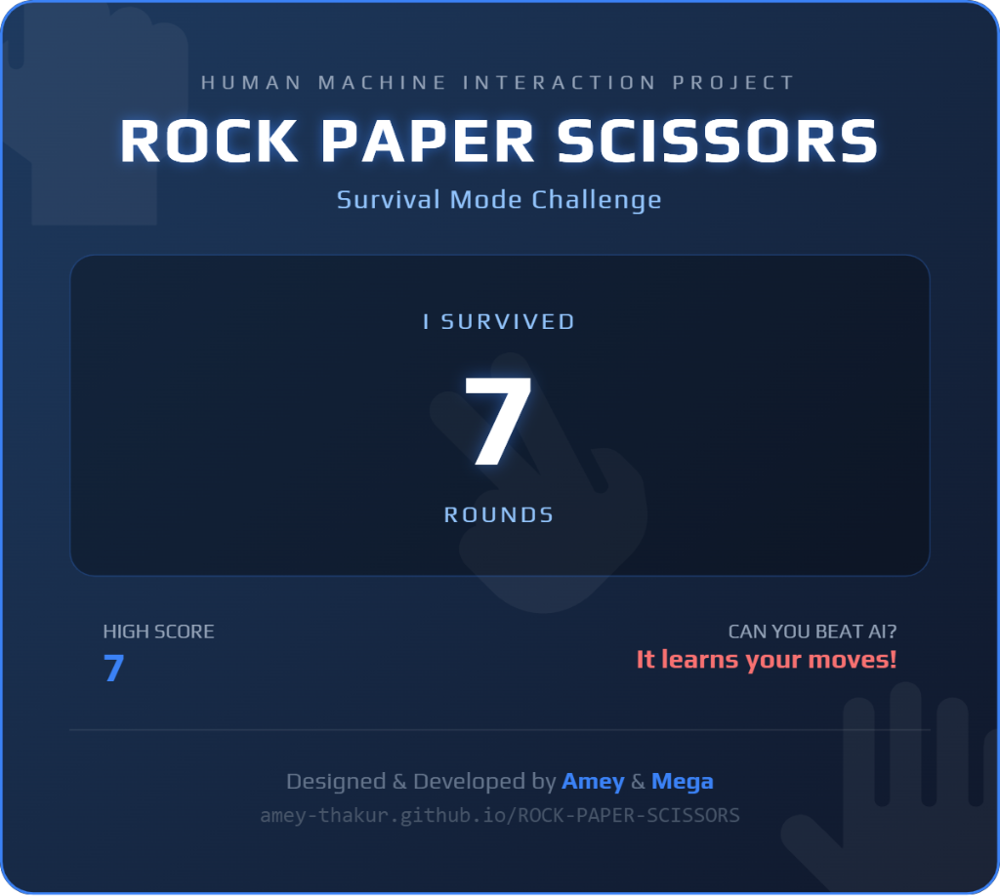

<div align="center">

  <a name="readme-top"></a>
  # Rock Paper Scissors

  [](LICENSE)
  
  [](https://github.com/Amey-Thakur/ROCK-PAPER-SCISSORS)
  [](https://github.com/Amey-Thakur/ROCK-PAPER-SCISSORS)

  A classic Rock Paper Scissors game implemented as a responsive web application, featuring interactive gameplay and score tracking.

  **[Source Code](Source%20Code/)** &nbsp;·&nbsp; **[Technical Specification](docs/SPECIFICATION.md)** &nbsp;·&nbsp; **[Live Demo](https://amey-thakur.github.io/ROCK-PAPER-SCISSORS/)**

</div>

---

<div align="center">

  [Authors](#authors) &nbsp;·&nbsp; [Overview](#overview) &nbsp;·&nbsp; [Features](#features) &nbsp;·&nbsp; [Structure](#project-structure) &nbsp;·&nbsp; [Results](#results) &nbsp;·&nbsp; [Quick Start](#quick-start) &nbsp;·&nbsp; [Usage Guidelines](#usage-guidelines) &nbsp;·&nbsp; [License](#license) &nbsp;·&nbsp; [About](#about-this-repository) &nbsp;·&nbsp; [Acknowledgments](#acknowledgments)

</div>

---

<!-- AUTHORS -->
<div align="center">

  <a name="authors"></a>
  ## Authors

  **Terna Engineering College | Computer Engineering | Batch of 2022**

| <a href="https://github.com/Amey-Thakur"></a><br>[**Amey Thakur**](https://github.com/Amey-Thakur)<br><br>[](https://orcid.org/0000-0001-5644-1575) | <a href="https://github.com/msatmod"></a><br>[**Mega Satish**](https://github.com/msatmod)<br><br>[](https://orcid.org/0000-0002-1844-9557) |
| :---: | :---: |

</div>

> [!IMPORTANT]
> ### 🤝🏻 Special Acknowledgement
> *Special thanks to **[Mega Satish](https://github.com/msatmod)** for her meaningful contributions, guidance, and support that helped shape this work.*

---

<!-- OVERVIEW -->
<a name="overview"></a>
## Overview

**Rock Paper Scissors** is an interactive simulation of the classic zero-sum hand game, engineered to demonstrate real-time user feedback and state management. The interface acts as a transparent mediator between the user's input and the system's random logic generation.

### HMI Principles
The development of this interface was guided by core **Human-Machine Interaction** paradigms:
*   **System State Visibility**: The UI provides immediate confirmation of user choices and computer counter-moves, ensuring the user never has to guess the system's status.
*   **Response Latency**: The system is optimized for negligible delay between input and result display, maintaining the illusion of a continuous, "live" interaction.

> [!TIP]
> **Feedback & Affordance**
>
> The interactive icons for Rock, Paper, and Scissors rely on strong **Affordances** - their visual design clearly invites clicking. Coupled with the immediate "glow" effect upon selection, the system provides distinct **Visual Feedback**, confirming to the user that their input has been registered and the system state has changed, a critical requirement for highly interactive systems.

---

<!-- FEATURES -->
<a name="features"></a>
## Features

| Feature | Description |
|---------|-------------|
| **Survival Mode** | High-stakes gameplay where every loss depletes a life, challenging players to "survive" against the AI. |
| **Smart AI** | An intelligent opponent that adapts to player patterns, creating a challenging and dynamic experience. |
| **Real-Time Physics** | **Floating Ghost Icons** drift through the background, adding atmospheric depth without distraction. |
| **Premium Analytics** | **High-Fidelity PDF-Ready Share Cards** generated instantly for performance sharing. |
| **Score Tracking** | Persistent high score system using Web LocalStorage to track lifetime bests. |
| **Adaptive UI** | Fully **responsive glassmorphic interface** optimized for mobile, tablet (iPad), and desktop. |
| **Audio Immersion** | Procedural sound generation for game events, complete with a discreet **Mute Toggle**. |

> [!NOTE]
> ### Interactive Polish: The Survival Aesthetic
> We have reimagined the classic game as a "Survival Challenge," introducing a health-point system (Hearts) that transforms a simple pastime into a tension-filled arcade experience. The visual language has been elevated with a **Deep Blue Glassmorphism** theme, ensuring every element - from the floating background particles to the "right-handed" vertical icons - feels purposeful and premium. Complementing this experience, the application includes a high-fidelity performance summary feature, with each shareable scorecard digitally signed by **Amey & Mega**.

### Tech Stack
- **Languages**: HTML5, CSS3, JavaScript (ES6+)
- **Logic**: Vanilla JS (Game Loop & State Management)
- **Imaging**: **html2canvas** (Custom high-fidelity capture engine)
- **UI System**: Premium Glassmorphic Design (Custom Vanilla CSS3)
- **Deployment**: GitHub Actions (Staging & Continuous Delivery Workflow)
- **Hosting**: GitHub Pages

---

<!-- STRUCTURE -->
<a name="project-structure"></a>
## Project Structure

```python
ROCK-PAPER-SCISSORS/
│
├── .github/                            # GitHub Actions & Automation
│   └── workflows/
│       └── deploy.yml                  # Automated Staging & Deployment Flow
│
├── docs/                               # Technical Documentation
│   └── SPECIFICATION.md                # Architecture & Design Specification
│
├── Mega/                               # Archival Attribution Assets
│   ├── Filly.jpg                       # Companion (Filly)
│   └── Mega.png                        # Author Profile Image (Mega Satish)
│
├── screenshots/                        # Project Visualization Gallery
│   ├── 01-game-start.png               # Landing State
│   ├── 02-draw-rock.png                # Gameplay Variations (Draw)
│   ├── 03-draw-paper.png               # Gameplay Variations (Draw)
│   ├── 04-draw-scissors.png            # Gameplay Variations (Draw)
│   ├── 05-lose-round.png               # Gameplay Variations (Lose)
│   ├── 06-win-round.png                # Gameplay Variations (Win)
│   ├── 07-scoring.png                  # Progressive Scoring State
│   ├── 08-last-life.png                # Survival Mode Critical State
│   ├── 09-game-over.png                # Performance Summary Modal
│   ├── 10-share-card.png               # Share Score Performance Card
│   └── 11-mobile-view.png              # Adaptive Responsive Interface
│
├── Source Code/                        # Primary Application Layer
│   ├── css/                            # UI Design System
│   ├── images/                         # Core Brand Assets
│   ├── js/                             # Application Logic Layer
│   ├── 404.html                        # Custom Error Page
│   ├── favicon.png                     # System Identity Icon
│   ├── index.html                      # Main Entry Point
│   └── poster.html                     # Social Media Preview Poster
│
├── .gitattributes                      # Git configuration
├── CITATION.cff                        # Scholarly Citation Metadata
├── codemeta.json                       # Machine-Readable Project Metadata
├── LICENSE                             # MIT License Terms
├── README.md                           # Comprehensive Archival Entrance
└── SECURITY.md                         # Security Policy & Protocol
```

---

<!-- RESULTS -->
<a name="results"></a>
## Results

<div align="center">
  <b>Main Landing Screen</b>
  <br><br>
  
  <br><br><br>

  <b>Gameplay: Win Interaction</b>
  <br><br>
  
  <br><br><br>

  <b>Gameplay: Draw Outcome</b>
  <br><br>
  
  <br><br><br>

  <b>Gameplay: Lose Outcome</b>
  <br><br>
  
  <br><br><br>

  <b>Final Score & High Score Record</b>
  <br><br>
  
  <br><br><br>

  <b>Share Score Card</b>
  <br><br>
  
</div>

---

<!-- QUICK START -->
<a name="quick-start"></a>
## Quick Start

### 1. Prerequisites
- **Browser**: Any modern standards-compliant web browser (Chrome, Firefox, Edge, Safari).
- **Environment**: No server-side runtime is required; this is a static client-side application.

> [!WARNING]
> **Local Execution**
>
> While the project can be executed by opening `index.html` directly, certain features may require an active internet connection to resolve external libraries correctly.

### 2. Setup & Deployment
1.  **Clone the Repository**:
    ```bash
    git clone https://github.com/Amey-Thakur/ROCK-PAPER-SCISSORS.git
    cd ROCK-PAPER-SCISSORS
    ```
2.  **Launch**:
    Open `Source Code/index.html` in your preferred browser.

---

<!-- =========================================================================================
                                     USAGE SECTION
     ========================================================================================= -->
## Usage Guidelines

This repository is openly shared to support learning and knowledge exchange across the academic community.

**For Students**  
Use this project as reference material for understanding interactive system design, web development patterns, and Human Machine Interaction principles. The source code is available for study to facilitate self-paced learning and exploration of user-centric design patterns.

**For Educators**  
This project may serve as a practical lab example or supplementary teaching resource for Human Machine Interaction and Human Machine Interaction Laboratory courses (`CSC801` & `CSL801`). Attribution is appreciated when utilizing content.

**For Researchers**  
The documentation and design approach may provide insights into academic project structuring and interactive web application development.

---

<!-- LICENSE -->
<a name="license"></a>
## License

This repository and all its creative and technical assets are made available under the **MIT License**. See the [LICENSE](LICENSE) file for complete terms.

> [!NOTE]
> **Summary**: You are free to share and adapt this content for any purpose, even commercially, as long as you provide appropriate attribution to the original authors.

Copyright © 2022 Amey Thakur & Mega Satish

---

<!-- ABOUT -->
<a name="about-this-repository"></a>
## About This Repository

**Created & Maintained by**: [Amey Thakur](https://github.com/Amey-Thakur) & [Mega Satish](https://github.com/msatmod)  
**Academic Journey**: Bachelor of Engineering in Computer Engineering (2018-2022)  
**Institution**: [Terna Engineering College](https://ternaengg.ac.in/), Navi Mumbai  
**University**: [University of Mumbai](https://mu.ac.in/)

This project features **Rock Paper Scissors**, developed as a **Human Machine Interaction** project during the **8th Semester Computer Engineering** curriculum. It demonstrates the creation of interactive web-based games.

**Connect:** [GitHub](https://github.com/Amey-Thakur) &nbsp;·&nbsp; [LinkedIn](https://www.linkedin.com/in/amey-thakur) &nbsp;·&nbsp; [ORCID](https://orcid.org/0000-0001-5644-1575)

### Acknowledgments

Grateful acknowledgment to [**Mega Satish**](https://github.com/msatmod) for her exceptional collaboration and scholarly partnership during the development of this classic game project. Her constant support, technical clarity, and dedication to software quality were instrumental in achieving the system's functional objectives. Learning alongside her was a transformative experience; her thoughtful approach to problem-solving and steady encouragement turned complex requirements into meaningful learning moments. This work reflects the growth and insights gained from our side-by-side academic journey. Thank you, Mega, for everything you shared and taught along the way.

Grateful acknowledgment to the faculty members of the **Department of Computer Engineering** at Terna Engineering College for their guidance and instruction in Human Machine Interaction. Their expertise and support helped develop a strong understanding of interactive system design.

Special thanks to the **mentors and peers** whose encouragement, discussions, and support contributed meaningfully to this learning experience.

---

<div align="center">

  [↑ Back to Top](#readme-top)

  [Authors](#authors) &nbsp;·&nbsp; [Overview](#overview) &nbsp;·&nbsp; [Features](#features) &nbsp;·&nbsp; [Structure](#project-structure) &nbsp;·&nbsp; [Results](#results) &nbsp;·&nbsp; [Quick Start](#quick-start) &nbsp;·&nbsp; [Usage Guidelines](#usage-guidelines) &nbsp;·&nbsp; [License](#license) &nbsp;·&nbsp; [About](#about-this-repository) &nbsp;·&nbsp; [Acknowledgments](#acknowledgments)

  <br>

  🔬 **[Human Machine Interaction Laboratory](https://github.com/Amey-Thakur/HUMAN-MACHINE-INTERACTION-AND-HUMAN-MACHINE-INTERACTION-LAB)** &nbsp; · &nbsp; ✂️ **[ROCK-PAPER-SCISSORS](https://amey-thakur.github.io/ROCK-PAPER-SCISSORS)**

  ---

  ### 🎓 [Computer Engineering Repository](https://github.com/Amey-Thakur/COMPUTER-ENGINEERING)

  **Computer Engineering (B.E.) - University of Mumbai**

  *Semester-wise curriculum, laboratories, projects, and academic notes.*

</div>

TEMP_LINE
