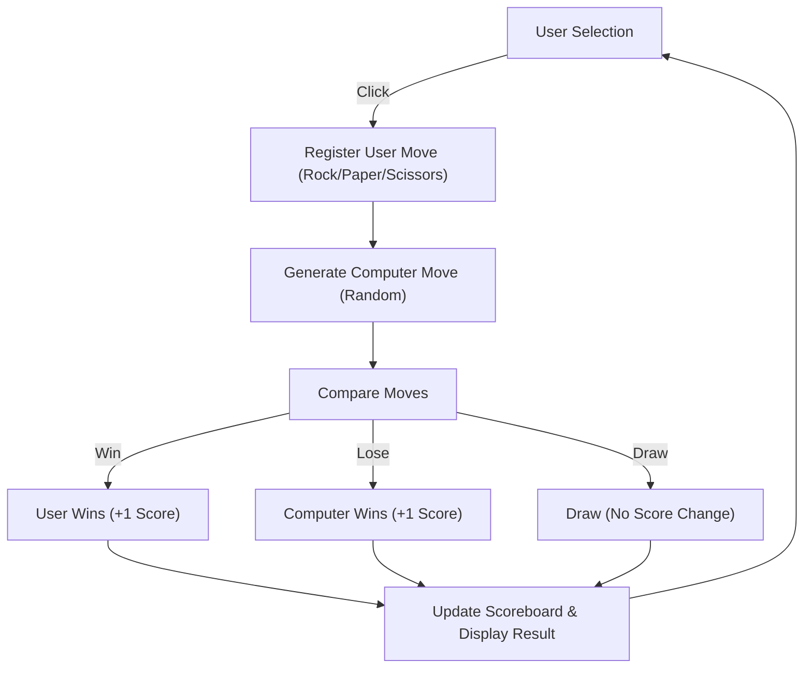

# Technical Specification: Rock Paper Scissors

## Architectural Overview

**Rock Paper Scissors** is a digital implementation of the classic hand game, designed to explore basic game theory and interaction design. The application simulates the zero-sum game environment where users compete against a computer algorithm, providing instant visual feedback and score tracking.

### Game Logic Flow

---

## Technical Implementations

### 1. Frontend Architecture
-   **Structure**: HTML5 provides the semantic markup for the game board, including distinct areas for user controls, the scoreboard, and the results display.
-   **Styling**: CSS3 is utilized to style the interactive elements, using visual cues (icons/images) for Rock, Paper, and Scissors to enhance learnability and usability.

### 2. JavaScript Logic
-   **Core Module**: `script.js` encapsulates the game rules and state management.
-   **Decision Algorithm**: A `Math.random()` implementation generates the computer's choice, ensuring an unpredictable and fair gameplay experience proposed by the probability distribution of 1/3 for each option.
-   **State Management**: Variables track the user and computer scores, updating the DOM dynamically after each round without requiring a page refresh.
-   **Event Handling**: Event listeners attached to the UI elements trigger the game loop upon user interaction.

### 3. Deployment Pipeline
-   **CI/CD**: The project leverages **GitHub Actions** to deploy the static `Source Code` directly to **GitHub Pages**, ensuring rapid delivery of updates.

---

## Technical Prerequisites

-   **Runtime**: Any modern web browser.
-   **Dependencies**: Zero-dependency architecture (Vanilla JS).

---

*Technical Specification | Human Machine Interaction | Version 1.0*
